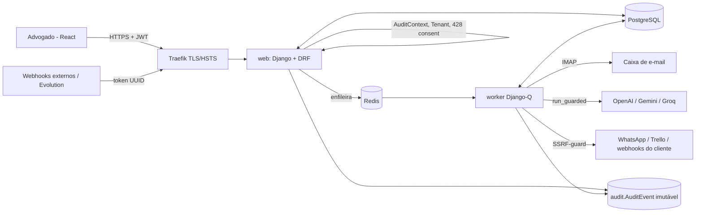

# 🏗️ Arquitetura Técnica — Cadrius AI

Arquitetura em camadas, orientada a eventos (EDA simplificada), com governança transversal (auditoria, privacidade, IA, conformidade).

## 1. Fluxo de dados

1. **Ingestão** — `tasks.fetch_emails` (IMAP) ou `POST /api/workflows/webhooks/catch/<token>/` persistem o payload (`ExecutionLog`) *antes* de enfileirar.
2. **Orquestração** — `execute_workflow_pipeline` (cota) → `process_workflow_execution` (worker).
3. **Inteligência** — `aigov.guard.run_guarded` (política do escritório, kill switch, limite, registro sem conteúdo) → `extraction.ai_wrapper` (texto delimitado contra *prompt injection*, saída validada por Pydantic).
4. **Ação** — execução com *retry*; ações de **origem IA** aguardam confirmação humana conforme a política (`PENDING_REVIEW`); chamadas externas passam por `integrations.ssrf`.
5. **Rastro** — cada passo relevante gera um `AuditEvent` (cadeia SHA-256 + trigger no PostgreSQL).

## 2. Apps
| App | Responsabilidade |
|---|---|
| `accounts` | usuários, organizações, memberships, RBAC (`permissions`), isolamento (`tenancy`), SSO |
| `billing` | planos, cotas, Stripe |
| `emails` / `extraction` / `integrations` / `tasks` / `webhooks` | caixas IMAP, extração por IA, conexões/execução externa, tarefas, entrada de eventos |
| `workflows` | Workflow/Trigger/Action/ExecutionLog, runner assíncrono, rascunhos de IA e aprovação |
| **`audit`** | trilha imutável, contexto da requisição, anomalias A1–A12, retenção, API por escritório |
| **`privacy`** | documentos legais versionados, consentimento, DSR, retenção, offboarding |
| **`aigov`** | política de IA, kill switch global, log de uso, rascunhos/aprovações |
| **`compliance`** | catálogo ISO 27001 (93), ISO 27701, LGPD; 40 verificações automáticas; RoPA; telas `/security-center/` + API |

## 3. Stack
Python 3.11 · Django 5.2 · DRF + SimpleJWT (blacklist) · Django-Q2 + Redis · PostgreSQL 15 · Traefik 2.10 · Docker Compose (base + override dev + prod) ·
Sentry · Dozzle · GitHub Actions. *Não fazem parte da stack atual (constavam no documento do projeto):* Celery, Django Channels, pgvector, Mosquitto/MQTT.

## 4. Modelo de dados (resumo)
`Organization 1—N OrganizationMembership N—1 CustomUser` · `Organization 1—N Workflow 1—1 Trigger (→ AppConnection)` · `Workflow 1—N Action` ·
`Workflow 1—N ExecutionLog (ai_origin, review_*)` · `MailBox (cifrada) 1—N EmailMessage` · `AuditEvent` (UUID da org, sem FK) ·
`LegalDocument 1—N ConsentRecord` · `DataSubjectRequest` · `AIGovernancePolicy 1—1 Organization` · `ControlAssessment`.

## 5. Decisões de segurança (ADR resumido)
- **Trilha sem FK para Organization/User**: apagar/anonimizar nunca apaga o rastro (LGPD art. 16 permite manter por obrigação legal/segurança).
- **Sessões `cached_db`**: resiliente à queda do Redis (o backend `cache` puro travava o login).
- **Compose em 3 arquivos**: produção segura por omissão; conveniências de dev isoladas no `override`.
- **IA nunca decide sozinha**: rascunho inativo + aprovação humana (RNE-016) e confirmação de ações externas (RF-023) por política.
